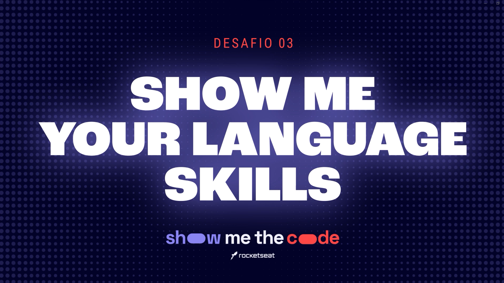

<h1 align="center">Show me the code - Show me your language skills</h1>

  

## Project

Episode 3 of Rocketseat's show me the code event. Show me your language skills.

## Features

- Alternative text in Images;
- Dark theme;
- Reading text in Libras;
- Colors have been adjusted;

## Technologies/Libraries/Environment

- Windows 10 Home | 22H2
- [Visual Studio Code | 1.95.3](https://code.visualstudio.com/)
- [Netlify](https://www.netlify.com/)

## List of where the analysis was done

- [WAVE](https://wave.webaim.org/)
- [accessMonitor](https://accessmonitor.acessibilidade.gov.pt/)
- [Google Lighthouse](https://pagespeed.web.dev/)
- [ASES](https://asesweb.governoeletronico.gov.br/)

## License

This project is under the MIT license. See the [LICENSE](LICENSE.md) file for more details.